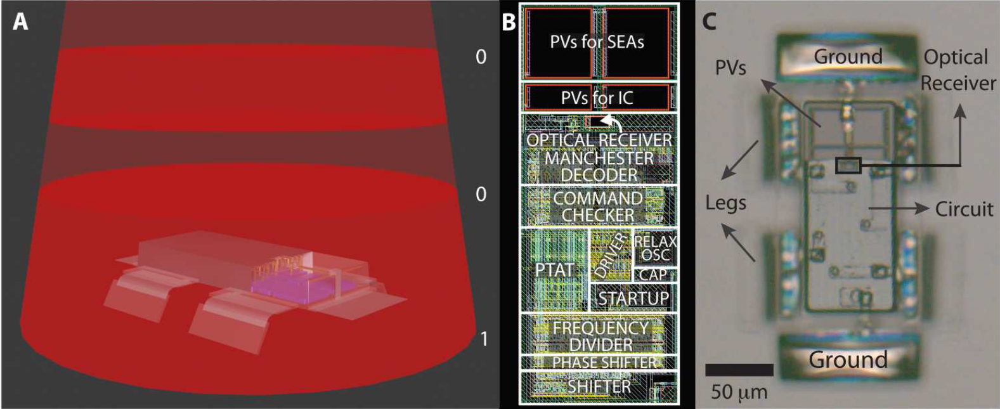

#  TT10 - Microrobot Circuits Documentation [↩](../README.md)

Detailed information regarding each circuit can be found in their respective files:
- [Piezoelectric Actuation Driver](driver.md)
- [Relaxation Oscillator](oscillator.md)
- [Current Reference (PTAT)](reference.md)
- [Power-on-Reset](supervisory.md)
- [Startup](startup.md)
- [ESD Protection](esd.md)
- [Decoder](decoder.md)
- [Computation](cmdchker.md)

This Tapeout explores some basic low-power, low-cost circuits inspired by Michael F. Reynolds et. al. work Microscopic robots with onboard digital control (2022) [[1]](#1). 
<br>

The image below shows one of the papers robots. This "Dogbot" is able to harvest-energy, receive commands and move on it's own without the need of external actuation.


<br>

## Table of contents
### 1. [↪](#1-background-of-this-tapeout-) Background of this Tapeout
### 2. [↪](#2-disclaimer-) Disclaimer
### 3. [↪](#3-requirements-) Requirements
### 4. [↪](#4-design-choices) Design Choices
### 5. [↪](#5-results-) Results


# 1. Background of this Tapeout [↩](#tt10---microrobot-circuits-documentation-)
This tapeout supports the [Open Source Mobile Microrobotics Framework SuRF 🏄‍♀️](https://github.com/jonoboderbonobo/surf/), providing silicon-proven, open source circuit blocks for on-board actuation. These low-power, low-cost designs help researchers and engineers test a wide range of actuation, communication, and energy-harvesting methods in real-life conditions. 
<br> 

With SuRF 🏄‍♀️, the goal is to bring microrobotics closer to practical applications.


# 2. Disclaimer [↩](#tt10---microrobot-circuits-documentation-)
### Quality
This is the first time for me, a student, designing any integrated circuit. I therefore do not recommend engaging in any of the proposed circuits before I confirmed their behavior by physically testing them. This tapeout only lays the groundwork for future iterations. 
<br> 

### Originality
The source of all the proposed circuits is **not** my creativity, but rather blatant copies of other poeples work. 
Even making those circuits working is infact only a secondary goal in this tapeout.
<br>

### Shoutout
I would like to mention following contributors here in one spot in addition to referencing throughout the documenation:
- [Metin Sitti](https://en.wikipedia.org/wiki/Metin_Sitti) for encouraging me in the need of more application-oriented point of view in microrobotics throught his [papers](https://scholar.google.com/citations?user=YU4Ce_MAAAAJ&hl=de), [book](https://archive.org/details/mobilemicrorobot0000sitt/mode/2up) and in person.
- [Harald Pretl](https://iic.jku.at/team/pretl/) for encouraging me in the feasibility of creating my own microrobot ICs. And additionally for simplifying the setup for all the tools by providing a [docker container](https://github.com/iic-jku/IIC-OSIC-TOOLS/).
- [Matt Venn](https://www.zerotoasiccourse.com/matt_venn/) for making it possible to a poor student like me to engage in hands on IC-Design by founding [Tiny Tapeout](https://tinytapeout.com/).
- [Carsten Wulff](https://analogicus.com/) for teaching me alot about IC-Design by making his [Script](https://analogicus.com/aic2024/assets/aic.pdf), [Slides](https://analogicus.com/aic2024/) and [Lectures](https://www.youtube.com/watch?v=DVBnfpi90Cs&list=PLybHXZ9FyEhbm9-A3QR1NRlt6VxeTXYr5) public.
- [Stefan Schippers](https://www.youtube.com/@stefsport2002/videos) for maintaining [xschem](https://github.com/StefanSchippers/xschem)
- [Hisham Elreedy](https://github.com/hishamelreedy) for designing, testing and documenting a [bandgap-voltage-reference](https://github.com/hishamelreedy/BandGapReference_sky130) in sky130 so I could learn from it.
- [John Kustin](https://github.com/johnkustin) for designing, testing and documenting a [bandgap-voltage-reference](https://github.com/johnkustin/bandgapReferenceCircuit) in sky130 so I could learn from it.
- TBD
- TBD
- TBD
- TBD
- Everyone else in the Open-Source community I am too ignorant to even know, but who still make it possible for someone without the financial possibilities to engage hands on IC-design.


# 3. Requirements [↩](#tt10---microrobot-circuits-documentation-)
To understand the requirements on the circuits we first have to understand the circuits mission profile. The mission profile is heavily influenced by "Dogbot" as well as arbitrary design choices by myself rather than a real world application.
## Dogbot: similarities and differences
For this tapeout, a design similar to Michael F. Reynolds et al. Dogbot [[1]](#1) was selected.

### Limitations of Dogot:
- circuit built with NDA protected PDK
    - [XT018](https://www.xfab.com/xt018) from X-FAB Silicon Foundries
- low speed
    - $ v_{max} = 0.1 \text{ body lengths per second} = 10 \frac{\text{um}}{\text{s}}$ 
- low energy efficiency 
    - $\eta = 10^{-11} = 0.000000001\%$
- enviroment dependant actuation method
    - $\text{Solution with } \mathrm{OH}^{-}, \mathrm{H_2O}, \mathrm{H_2PO4}^{-} \text{ or } \mathrm{O2}^{-}
    $ [[2]](#2)
### Proposed Solutions:
Using Skywater130 PDK and changing the actuation method from electrochemical actuation to piezoelectric actuation results in:
- no NDA required
- $ v_{max}=1 \text{ BDL/s} = 100 \frac{\text{um}}{\text{s}}$ 
- $\eta > 1\% $
- relatively enviroment independant

with the downside of aquiring all energy needed for actuation from on-chip energy harvesting, which can be compensated by the high energy efficiency.
### Resulting Design Choices :
- Dimensions
    - overall size: 100x100 um
    - chip size: 50x100 um
    - actuator count: 4
    - actuator size: 25x50 um
    - body-surface distance (leg length): 25 um
- Movement:
    - locomtion type: crawling
    - crawling type: stick-slip
    - actuation type: piezo-electric actuation
    - Number legs: 4
    - locomotion type: TBD
    - speed: 1 body-length/s = 100 um/s
- Enviroment
    - interface: solid-fluid
    - solid: smooth SiO2 (Wafer Surface)
    - fluid: air (as gas) 
    - temperature 290-310 K
    - external forces: None
- Communication
    - transmission type: undefined
    - transmission speed: TBD
    - com direction: receiving only
    - Package Size: 4-Bit
    - Commands: 8
- Energy Harvesting
    - Conversion type: Photovolatic
    - Efficiency: 20%
    - Voltage Level: 2V
- No Sensing

## Mission Profile
As previously stated, no explicit application scenario is required. Instead, a customized mission profile was chosen to align with Dogbot-like requirements while still providing sufficient design challenges. 
```
Two microrobots sort human cells scattered on a silicon wafer. This wafer is located in a controlled environment without notable airflow, electromagnetic interference, vibration or temperature gradients. Both robots receive the same broadcast commands from a single monitoring program that uses a camera for observing the wafer’s surface.
```

### Data
- light
    - intensity:
    - TBD
- TBD
## Circuit Requirements
Depending on the previous discussed mission profile, we can now determine the requirements on each of the sub-circuits.
<br>

General information on microrobot requirements regarding on-board electronics can be found [here](https://github.com/jonoboderbonobo/surf/specs/requirements_on_microrobots.md), but can be condensed to:

 - **ultra-low-power (ULP)**
 - **low-cost** 

## Driver
| Metric                  | Unit | Dogbot | Goal | TT10 |
|----------------------|---------|----------------|------|------|
| -         | -          | -          | -           | -           |
| -         | -          | -          | -           | -           |
| -         | -          | -          | -           | -           |
| -         | -          | -          | -           | -           | 
| -         | -          | -          | -           | -           | 
| -         | -          | -          | -           | -           | 
| -         | -          | -          | -           | -           | 


Template
| Metric                  | Unit | Dogbot | Goal | TT10 |
|----------------------|---------|----------------|------|------|
| -         | -          | -          | -           | -           |
| -         | -          | -          | -           | -           |
| -         | -          | -          | -           | -           |
| -         | -          | -          | -           | -           | 
| -         | -          | -          | -           | -           | 
| -         | -          | -          | -           | -           | 
| -         | -          | -          | -           | -           | 


# 4. Design Choices [↩](#tt10---microrobot-circuits-documentation-)


# 5. Results [↩](#tt10---microrobot-circuits-documentation-)


# References
<a id="1">[1]</a> <br>
[M. F. Reynolds et al., “Microscopic robots with onboard digital control,” Sci. Robot., vol. 7, no. 70, p. eabq2296, Sep. 2022, doi: 10.1126/scirobotics.abq2296.](https://www.science.org/doi/10.1126/scirobotics.abq2296)

<a id="2">[2]</a> <br>
[M. Z. Miskin et al., “Electronically integrated, mass-manufactured, microscopic robots,” Nature, vol. 584, no. 7822, pp. 557–561, Aug. 2020, doi: 10.1038/s41586-020-2626-9.](https://www.nature.com/articles/s41586-020-2626-9)


as of now only POR needed which I will just include into the "Startup Circuit"

- Trip point
    - min
    - tpyical
    - max
- min reset timeout (ms)
- reset output stage
    - active Low: Push-pull, Internal, pull-up, pull-down, open-drain
    - active High: Push-pull, Internal, pull-up, pull-down, open-drain
- area
- power


| Circuit Type      | Dogbot | TT10 Simulated |
|----------------------|---------|----------------|
| Energy Harvesting |Photovoltaic|Photovoltaic|
| Actuation |Electrochemical|Piezoelectric|
| Receiver |Optical |TBD| 


| Circuit Type      | Dogbot | TT10 Hardware |
|----------------------|---------|----------------|
| Driver |?|TBD| 
| Clock| Relaxation Oscillator |Relaxation Oscillator| 
| Reference |PTAT|PTAT| 
| Startup|Capacitor (?)|Diode | 
| ESD Protection|?|TDB| 
| Decoder|Manchester|Manchester| 
| Computation|Command Checker|Command Checker| 